# Architecture Overview

## Intent

Help couples quickly decide on a movie to watch together. Stop endless scrolling through streaming services, start actually watching.

The core insight: choosing a movie is a matching problem, not a discovery problem. Two people each have preferences — the goal is to find the intersection, not optimize for either individually.

## Responsibilities

### 1. Room-Based Matching

- Create ephemeral rooms with 4-digit codes
- Join via code (no accounts, no passwords)
- Real-time sync of partner's progress
- Match notification when both like the same movie

### 2. Movie Discovery

- Static list for MVP (50 popular movies)
- Swipe left (pass) / right (like) interface
- Show progress ("Movie 12 of 50")
- Display matches immediately

### 3. Session Management

- Browser-based sessions (cookies)
- No persistent user accounts
- Re-join room via code if disconnected

## System Context (C4 Level 1)

Shows how CineMatch enables couples to find movies they both want to watch.


## Container Diagram (C4 Level 2)

Shows the internal structure of CineMatch.

```mermaid
flowchart TB
    P1["👤 Partner 1<br/>Browser/Mobile"]
    P2["👤 Partner 2<br/>Browser/Mobile"]

    subgraph CineMatch ["CineMatch System"]
        FE["🖥️ Frontend<br/><i>[Container: Next.js]</i><br/>Serves UI<br/>Handles swipes"]
        BE["⚡ Backend API<br/><i>[Container: FastAPI]</i><br/>Room management<br/>Vote matching"]
        DB[("🗄️ Database<br/><i>[Container: SQLite]</i><br/>Rooms, movies, votes")]
    end

    P1 -->|"HTTPS<br/>Create/join room"| FE
    P2 -->|"HTTPS<br/>Join room, swipe"| FE
    FE -->|"REST API<br/>/api/v1/*"| BE
    BE -->|"SQLAlchemy ORM"| DB

    classDef external fill:#999,stroke:#666,color:#fff,stroke-width:2px
    classDef container fill:#5b9bd5,stroke:#2e75b5,color:#fff,stroke-width:2px
    classDef db fill:#27ae60,stroke:#1e8449,color:#fff,stroke-width:2px
    classDef person fill:#1f4e79,stroke:#0f2e4f,color:#fff,stroke-width:2px

    class P1,P2 person
    class FE,BE container
    class DB db
```



### Container Responsibilities

| Container | Technology | Responsibility |
|-----------|------------|----------------|
| **Frontend** | Next.js 14 + shadcn/ui | Serves the swipe UI, handles room creation/joining, displays matches |
| **Backend API** | FastAPI + SQLAlchemy | Manages rooms, participants, movies, votes; calculates matches |
| **Database** | SQLite (MVP) | Stores rooms, movies, votes, participants |

## Component Diagram (C4 Level 3) - Backend


## Execution Flow

### Creating a Room and Finding a Match


## Infrastructure

CineMatch runs on AWS with complete isolation from other products.

### Deployment Architecture


### Environment Isolation

| Environment | Domain | Purpose |
|-------------|--------|---------|
| `production` | demo.cinematch.umans.ai | Live site |
| `pr-N` | demo-pr-N.cinematch.umans.ai | Preview for PR #N |

Each environment is a Terraform workspace with dedicated:
- ECS cluster
- ALB
- Security groups
- IAM roles

### Isolation Guarantees

- ✅ Dedicated VPC (10.1.0.0/16) - completely isolated network
- ✅ Dedicated ECS cluster per environment
- ✅ Dedicated ALB per environment
- ✅ Resource naming: all prefixed with `cinematch-*`
- ✅ No shared resources except Route53 zone (read-only)

## Data Flow

```
User → Route53 → ALB → ECS Service → Container
```

1. DNS resolves to ALB
2. ALB routes `/api/*` to backend (port 8000), everything else to frontend (port 3000)
3. Frontend talks to backend via internal API calls
4. Backend uses SQLite (ephemeral, per-container in MVP)

## Deployment Flow

### Production (push to main)

```
1. Run checks (lint, test, typecheck)
2. Build Docker images
3. Push to ECR with SHA tag
4. terraform workspace select production
5. terraform apply -var="image_tag=<sha>"
```

### Preview (pull request)

```
1. Run checks
2. Build Docker images
3. Push to ECR with pr-N tag
4. terraform workspace new pr-N
5. terraform apply
6. Comment PR with URL
```

## Technology Stack

| Layer | Technology |
|-------|------------|
| Frontend | Next.js 14, shadcn/ui, Tailwind CSS |
| Backend | FastAPI, SQLAlchemy, SQLite |
| Infrastructure | AWS ECS Fargate, ALB, Route53 |
| CI/CD | GitHub Actions, Terraform Workspaces |

## Key Decisions

See ADRs in `docs/architecture/decisions/`:
- **ADR-001**: Stack choice (Next.js + FastAPI)
- **ADR-002**: Same AWS account, isolated resources
- **ADR-003**: Preview environments with Terraform workspaces
- **ADR-004**: Project initialization from conversation
- **ADR-005**: Infrastructure isolation
