# CineMatch Architecture Overview

## Project Goal
Tinder-style movie picker for couples. Stop scrolling, start watching.

## Stack
- **Frontend**: Next.js 14 + shadcn/ui + Tailwind
- **Backend**: FastAPI + SQLite (MVP) → PostgreSQL (increment 2)
- **Infrastructure**: AWS ECS Fargate + ALB + Route53
- **CI/CD**: GitHub Actions + Terraform Workspaces

## Repository Structure

```
.
├── backend/           # FastAPI application
│   ├── app/          # Main application code
│   └── tests/        # Test suite
├── frontend/          # Next.js application
│   ├── app/          # App router pages
│   └── components/   # React components
├── operations/        # Terraform infrastructure
│   ├── 00-foundation/   # Shared resources (VPC, ECR, cert)
│   └── 01-service/      # Per-environment resources (ALB, ECS cluster, services)
├── docs/
│   ├── architecture/decisions/   # ADRs
│   └── backlog/                  # Increment tracking
└── .github/workflows/   # CI/CD pipelines
```

## Infrastructure Layers

### 00-foundation (One-time setup)
Applied manually, contains resources shared across ALL environments:

| File | Purpose |
|------|---------|
| `vpc.tf` | VPC (10.1.0.0/16), subnets, IGW, route tables |
| `ecr.tf` | ECR repositories for backend/frontend images |
| `cert.tf` | ACM certificate for *.cinematch.umans.ai |

**NOT deployed by CI/CD** - Run once manually.

### 01-service (Per-environment)
Applied by CI/CD for each environment (production, pr-123, etc.):

| File | Purpose |
|------|---------|
| `alb.tf` | Application Load Balancer |
| `ecs-cluster.tf` | ECS cluster (per environment) |
| `ecs-services.tf` | ECS services and task definitions |
| `security-groups.tf` | Security groups for ALB and ECS |
| `route53.tf` | DNS records per workspace |
| `iam.tf` | IAM roles per workspace |
| `logs.tf` | CloudWatch log groups |

**Deployed by CI/CD** - Automatically on push/PR.

## Environment Isolation

Each environment is a Terraform workspace:

| Workspace | Domain | Purpose |
|-----------|--------|---------|
| `production` | demo.cinematch.umans.ai | Live site |
| `pr-123` | demo-pr-123.cinematch.umans.ai | Preview for PR #123 |

Isolation guarantees:
- ✅ Dedicated ALB per environment
- ✅ Dedicated ECS cluster per environment
- ✅ Dedicated security groups per environment
- ✅ Shared: VPC, ECR, ACM certificate

## Isolation from llm-gateway

CineMatch is COMPLETELY ISOLATED from llm-gateway:

| Resource | CineMatch | llm-gateway |
|----------|-----------|-------------|
| VPC | 10.1.0.0/16 | 10.0.0.0/16 |
| ECS Cluster | cinematch | llm-gateway |
| ALB | Separate | Separate |
| Security Groups | cinematch-* | llm-gateway-* |
| IAM Roles | cinematch-* | llm-gateway-* |

Only shared: Route53 zone (umans.ai) - READ-ONLY reference.

## Architecture Diagrams

### C4 Context Diagram (Level 1)

```mermaid
flowchart TB
    subgraph Users["👥 Users"]
        P1["Partner 1<br/>(Browser/Mobile)"]
        P2["Partner 2<br/>(Browser/Mobile)"]
    end

    subgraph CineMatch["🎬 CineMatch System"]
        FE["Frontend<br/>(Next.js)"]
        BE["Backend API<br/>(FastAPI)"]
        DB[("SQLite<br/>(MVP)")]
    end

    P1 -->|"HTTPS<br/>Create/Join Room"| FE
    P2 -->|"HTTPS<br/>Join Room"| FE
    FE -->|"REST API<br/>/api/v1/*"| BE
    BE -->|"SQLAlchemy<br/>ORM"| DB

    style Users fill:#e1f5ff
    style CineMatch fill:#fff4e1
    style DB fill:#e8f5e9
```



### C4 Container Diagram (Level 2)

```mermaid
flowchart TB
    subgraph AWS["☁️ AWS Cloud (eu-west-1)"]
        subgraph Network["Network Layer"]
            DNS["Route 53<br/>cinematch.umans.ai"]
            ALB["Application Load Balancer<br/>HTTPS:443 → HTTP:80 redirect"]
        end

        subgraph ECS["ECS Fargate Cluster<br/>(per environment)"]
            subgraph FrontendSvc["Frontend Service"]
                FE1["Next.js Container<br/>Port 3000"]
            end

            subgraph BackendSvc["Backend Service"]
                BE1["FastAPI Container<br/>Port 8000"]
            end
        end

        subgraph Storage["Storage"]
            ECR["ECR Repositories<br/>cinematch-backend<br/>cinematch-frontend"]
            SQLite[("SQLite<br/>container-local")]
        end

        subgraph Security["Security"]
            SG1["Security Groups"]
            IAM["IAM Roles<br/>(task/execution)"]
        end
    end

    User["👤 User"] -->|"1. DNS Query"| DNS
    DNS -->|"2. ALB IP"| ALB
    ALB -->|"3. /api/* → Backend"| BE1
    ALB -->|"3. /* → Frontend"| FE1
    BE1 -->|"4. Read/Write"| SQLite
    FE1 -->|"Internal API calls"| BE1

    ECR -.->|"Pull images"| FE1
    ECR -.->|"Pull images"| BE1

    style AWS fill:#fff9e6
    style ECS fill:#e3f2fd
    style Storage fill:#f3e5f5
    style Security fill:#ffebee
```



### Component Diagram (Level 3)


### Execution Flow - User Creates Room and Swipes


### Deployment Flow


## Data Flow

Simplified view:
```
User → Route53 (cinematch.umans.ai) → ALB → ECS Service → Container
```

1. DNS resolves to ALB
2. ALB routes to target groups (frontend:3000, backend:8000)
3. Frontend talks to backend via `/api/*` routes (ALB routing)
4. Backend uses SQLite (MVP) or PostgreSQL (increment 2)

## Deployment Flow

### Production (push to main)
```
1. Run checks (lint, test, typecheck)
2. Build Docker images
3. Push to ECR with SHA tag
4. terraform workspace select production
5. terraform apply
```

### Preview (pull request)
```
1. Run checks
2. Build Docker images
3. Push to ECR with pr-N tag
4. terraform workspace new pr-N
5. terraform apply
6. Comment PR with URL
```

### Cleanup (PR closed)
```
1. terraform workspace select pr-N
2. terraform destroy
3. terraform workspace delete pr-N
```

## Increment Planning

See `docs/backlog/` for planned increments:

| # | Increment | Status | Location |
|---|-----------|--------|----------|
| 1 | MVP with static movies | ✅ DONE | `docs/backlog/done/00001-mvp-static-movies.md` |
| 2 | PostgreSQL migration | 📋 TODO | `docs/backlog/todo/00002-postgresql-migration.md` |
| 3 | TMDB API integration | 📋 TODO | `docs/backlog/todo/00003-tmdb-integration.md` |
| 4 | User accounts | 📋 TODO | `docs/backlog/todo/00004-user-accounts.md` |

## Key Decisions

- **SQLite for MVP**: Speed of development, migrate to PostgreSQL later
- **Workspace-based environments**: Simple, effective isolation
- **Dedicated ECS Cluster per environment**: Complete isolation
- **Separate VPC**: Maximum isolation from llm-gateway
