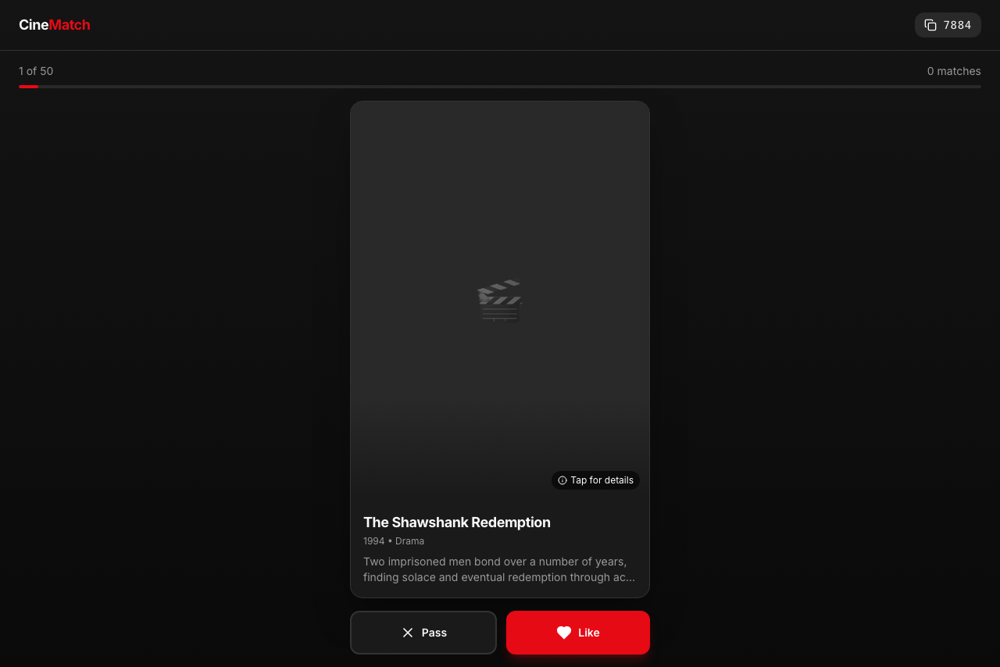
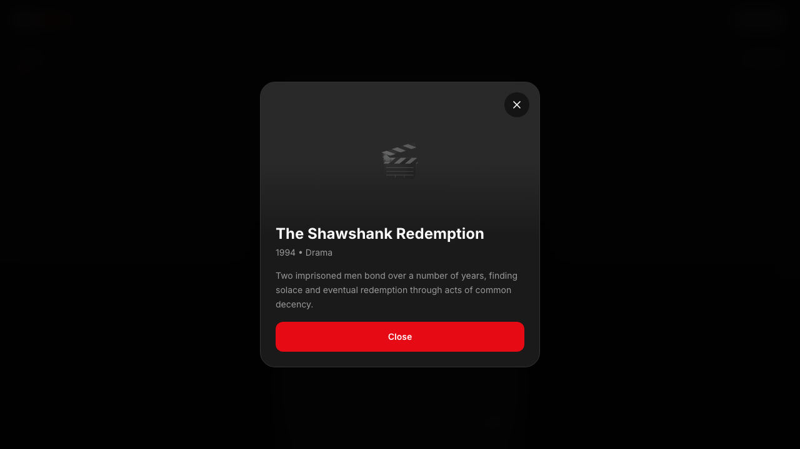

# Minimalistic UI Redesign

Redesign the CineMatch frontend with a clean, professional, minimal aesthetic inspired by Linear, Notion, and Apple design systems.

## Current State

The UI currently has:
- Pink/rose gradient backgrounds
- Generic shadcn/ui components
- No clear visual hierarchy
- Dated swipe card design
- Inconsistent spacing

## Goal

Transform the UI to feel like a premium, modern application with:
- Clean, minimal aesthetic
- Consistent spacing and typography
- Subtle, purposeful interactions
- Professional color palette

## Final Design System

### Color Palette (Dark Theme - Netflix Inspired)

```
--background: #0a0a0a (near-black)
--foreground: #ffffff (white)
--card: #141414 (dark gray)
--muted: #262626 (medium gray)
--muted-foreground: #737373 (gray text)
--border: #333333 (subtle borders)
--primary: #E50914 (Netflix red)
--primary-foreground: #ffffff
--radius: 0.75rem
```

### Typography

- Font: Inter (existing)
- Hero: 32px/700
- Title: 24px/600
- Body: 16px/400
- Small: 14px/400
- Tiny: 12px/500

### Spacing Scale

```
4px, 8px, 16px, 24px, 32px, 48px, 64px
```

## Implementation Plan

### Phase 1: Foundation
- [x] Update CSS variables in globals.css
- [x] Set up dark theme with red accent
- [x] Fix overscroll background issues

### Phase 2: Landing Page
- [x] Redesign centered layout
- [x] Single name input
- [x] Clean create/join flow
- [x] CineMatch branding with red accent

### Phase 3: Room/Swipe Page
- [x] Redesign movie card with fixed dimensions
- [x] Add progress indicator (red bar)
- [x] Clean header with room code copy
- [x] Simplified like/pass buttons (always visible)
- [x] Match celebration modal
- [x] Detail modal for full description

### Phase 4: Polish
- [x] Consistent spacing audit
- [x] Hover states
- [x] Focus states
- [x] Loading states
- [x] Fixed card layout (no button jumping)

## Final Screenshots

### 1. Landing Page
Dark theme with CineMatch branding, red gradient logo icon, and clear CTAs.


### 2. Room Page - Movie Swiping
Main interface with fixed card layout, always-visible Pass/Like buttons, progress bar, and "Tap for details" indicator.



### 3. Movie Detail Modal
Full movie information with complete description, larger poster, and close button.



## Testing Checklist

- [x] Landing page renders correctly
- [x] Can create room
- [x] Can join room with code
- [x] Movie cards display properly
- [x] Like/pass buttons work
- [x] Match modal appears
- [x] Detail modal opens on card tap
- [x] No overscroll white background
- [x] Buttons always visible (no scroll needed)
- [x] Responsive layout

## Success Criteria

- UI feels premium and intentional ✓
- Strong brand identity with red accent ✓
- No visual clutter or unnecessary elements ✓
- Clear visual hierarchy ✓
- Consistent spacing throughout ✓
- Fast, snappy interactions ✓
- Fixed layout (buttons don't jump) ✓
