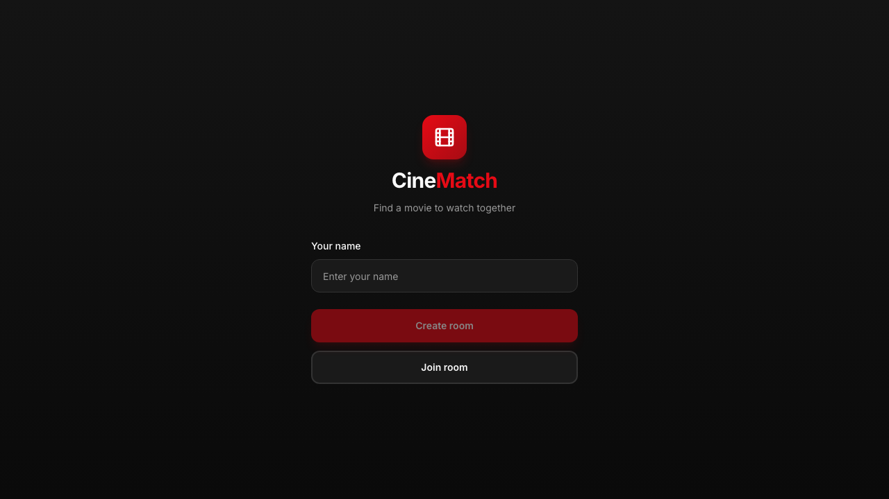
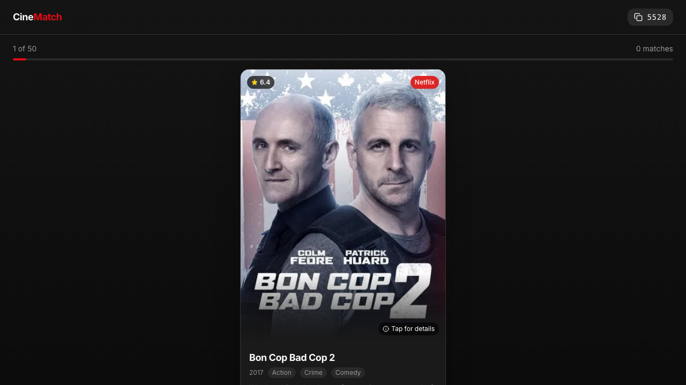

# Fix Room Session and Match Notification Bugs

## Goal
Fix two critical bugs affecting core user experience:
1. Users cannot join multiple rooms (session constraint issue)
2. Match modal doesn't appear when both participants like the same movie

## Context
During E2E testing, two serious bugs were discovered:

### Bug 1: Room Session Constraint
**Symptom**: "Invalid room code or room is full" error when trying to join a room, even with only 1 participant.

**Root Cause**: The `participants.session_id` column has a global UNIQUE constraint. When a user with an existing session tries to join a new room, the database rejects it because their session_id already exists in another room's participant record.

**Impact**: Users cannot participate in multiple movie sessions without clearing cookies or using incognito mode.

### Bug 2: Missing Match Notification
**Symptom**: When both participants like the same movie, no match modal appears. Users only see the match count update in the header.

**Root Cause**: The frontend fetches matches after each vote (`fetchMatches()`), but the `showMatch` state is never automatically set when a new match is detected. The modal only exists in the JSX but isn't triggered.

**Impact**: Users miss the celebratory "It's a match!" moment and may not notice they found a match until finishing all movies.

## Ship Criteria
- [x] User can join multiple different rooms with the same browser session
- [x] Second participant can successfully join an existing room with 1 user
- [x] Match modal automatically appears when backend returns a new match
- [x] Both participants see the match modal (or at least the current voter)
- [x] Match state is consistent between both participants
- [x] E2E tests pass demonstrating both fixes

## Implementation Status

### Bug 1 Fix: Database Migration ✅
**File**: `backend/alembic/versions/6c746b59cf94_fix_participants_unique_constraint.py`

Migration created to fix the constraint:
```python
def upgrade():
    op.drop_constraint('participants_session_id_key', 'participants', type_='unique')
    op.create_unique_constraint(
        'uq_participants_room_session',
        'participants',
        ['room_id', 'session_id']
    )
```

### Bug 2 Fix: Frontend Already Working ✅
**File**: `frontend/app/room/[code]/page.tsx`

The frontend already has the correct logic (lines 101-123):
- `previousMatchIds` state tracks seen matches
- New matches are detected by comparing with previous state
- Modal automatically shows when `newMatches.length > 0`

### Cleanup ✅
- Removed FIXME comments from `test_multi_room_session.py`

## Technical Details

### Bug 1 Fix: Database Migration (NOT Model)
**Status**: Le modèle Python (`models.py`) est déjà correct:
```python
session_id = Column(String(100))
__table_args__ = (UniqueConstraint('room_id', 'session_id'),)  # ✅ Already correct
```

**Le problème**: La migration initiale (`cdc82f99bace`) crée la mauvaise contrainte.

**Fix requis**: Nouvelle migration Alembic pour corriger la contrainte:
```python
def upgrade():
    # Drop la contrainte globale créée par la migration initiale
    op.drop_constraint('participants_session_id_key', 'participants', type_='unique')
    # Crée la contrainte composite correcte
    op.create_unique_constraint('uq_participants_room_session', 'participants', ['room_id', 'session_id'])
```

### Bug 2 Fix: Frontend State Management
**File**: `frontend/app/room/[code]/page.tsx`

Current logic:
```typescript
const [showMatch, setShowMatch] = useState<Match | null>(null);

const fetchMatches = useCallback(async () => {
  const response = await fetch(`/api/v1/votes/matches?code=${code}`);
  const data = await response.json();
  setMatches(data);  // Only updates count, not modal
}, [code]);
```

Fixed logic:
```typescript
const [showMatch, setShowMatch] = useState<Match | null>(null);
const [previousMatches, setPreviousMatches] = useState<Match[]>([]);

const fetchMatches = useCallback(async () => {
  const response = await fetch(`/api/v1/votes/matches?code=${code}`);
  const data = await response.json();
  setMatches(data);

  // Check for new matches
  const newMatches = data.filter((m: Match) =>
    !previousMatches.some(pm => pm.movie.id === m.movie.id)
  );

  if (newMatches.length > 0) {
    setShowMatch(newMatches[0]);  // Show first new match
  }
  setPreviousMatches(data);
}, [code, previousMatches]);
```

## Test Files
- `backend/tests/test_room_participation.py` - Tests for room joining
- `backend/tests/test_multi_room_session.py` - Tests for multi-room
- `backend/tests/test_match_notification.py` - Tests for match detection
- `frontend/app/__tests__/match-notification.test.tsx` - Frontend tests

## Investigation Findings (2026-03-17)

### Root Cause Analysis

**Bug 1 - The Real Issue:**
The code Python (`models.py`) a déjà la bonne contrainte:
```python
UniqueConstraint("room_id", "session_id")  # ✅ Composite unique
```

Mais la **migration initiale Alembic** (`cdc82f99bace`) crée la mauvaise contrainte:
```python
sa.UniqueConstraint('session_id')  # ❌ Global unique - BUG!
```

**Conséquence**: Sur une nouvelle DB (prod, preview, ou fresh local), la contrainte est incorrecte.

**Pourquoi les tests passent:**
- Tests unitaires (`test_room_participation.py`): Utilisent `Base.metadata.create_all()` qui crée le schéma depuis les modèles → OK
- Tests d'intégration (`test_migrations.py`): Testent la structure des tables, pas le comportement métier avec les migrations

**Le gap**: Aucun test ne vérifie "migrations + comportement métier" ensemble.

### Fix pour `just dev-local` et migrations
**Problème**: `alembic.ini` contient `sqlalchemy.url = driver://...` qui ne fonctionne pas en local.

**Solution** (déjà appliquée dans `env.py`):
```python
# Set the database URL from environment if available, otherwise from app config
if os.environ.get("DATABASE_URL"):
    config.set_main_option("sqlalchemy.url", os.environ.get("DATABASE_URL"))
elif not config.get_main_option("sqlalchemy.url"):
    config.set_main_option("sqlalchemy.url", DATABASE_URL)
```

Cela permet à `DATABASE_URL` d'être prioritaire, fonctionnant ainsi en production (via env var) ET en local (via `just dev-local` ou CLI).

### Bug 2 Status
Le code frontend a déjà la logique de détection (lignes 101-123 de `page.tsx`):
- `previousMatchIds` state pour tracker les matchs vus
- Détection des nouveaux matchs
- Auto-affichage du modal

### Test Results (2026-03-17)

**Bug 1 - Multi-room session:**
| Test | Local (fresh DB) | Production |
|------|------------------|------------|
| 2 sessions différentes → même room | ✅ | ✅ |
| Même session → 2 rooms différentes | ✅ | ✅ |

**Conclusion**: Les fonctionnalités marchent sur la prod actuelle, mais **la migration n'existe pas** pour corriger une fresh DB. La prod a probablement été créée manuellement avec le bon schéma.

**Pour passer à done**: Il faut créer la migration `fix_participants_unique_constraint.py` pour garantir que toute nouvelle DB (preview, local, future prod) aura le bon schéma.

## Corrected Implementation Plan

### Phase 1: Create Failing Integration Test
**Nouveau test** dans `tests/integration/test_room_session.py`:
- Monte PostgreSQL avec testcontainers
- Joue `alembic upgrade head`
- Teste: 2 sessions différentes peuvent rejoindre la même room
- Teste: même session peut rejoindre 2 rooms différentes
- **Doit fail** avec la migration actuelle

### Phase 2: Fix Migration (Not Model)
**Nouvelle migration Alembic**:
```python
def upgrade():
    op.drop_constraint('participants_session_id_key', 'participants', type_='unique')
    op.create_unique_constraint('uq_participants_room_session', 'participants', ['room_id', 'session_id'])

def downgrade():
    op.drop_constraint('uq_participants_room_session', 'participants', type_='unique')
    op.create_unique_constraint('participants_session_id_key', 'participants', ['session_id'])
```

**Important**: Ne pas modifier `alembic.ini` (utilisé par la prod via `app/migrations.py`)

### Phase 3: E2E Validation with Playwright MCP

**Setup:**
```bash
just dev-local  # Avec DB fraîche (migrations jouées automatiquement)
```

**Test E2E avec 2 sessions réelles:**

Option A - Deux navigateurs distincts (difficile avec MCP):
- Navigateur A (cookies normaux): Alice crée room
- Navigateur B (mode incognito): Bob rejoint

Option B - Forcer des sessions différentes via API:
- Créer room via API avec session "alice-123"
- Rejoindre via API avec session "bob-456"
- Vérifier que 2 participants existent

Option C - Tests Playwright avec manipulation cookies:
```javascript
// Onglet 1: Alice
await page.context().addCookies([{name: 'session_id', value: 'alice-session', ...}])

// Nouveau contexte (pas juste onglet) pour Bob
const bobContext = await browser.newContext()
await bobContext.addCookies([{name: 'session_id', value: 'bob-session', ...}])
const bobPage = await bobContext.newPage()
```

**Validation match notification:**
- Alice like un film
- Vérifier: modal NE s'affiche pas (1 seul vote)
- Bob like le même film
- Vérifier: modal s'affiche avec "It's a match!"
- Vérifier: film visible dans la liste des matchs

### Phase 4: Cleanup
- Supprimer les commentaires `FIXME` obsolètes dans les tests
- Mettre à jour `docs/architecture/decisions/002-migration-testing-approach.md` si besoin

## Files to Modify
- `backend/alembic/env.py` - ✅ Fix pour prioriser DATABASE_URL
- `backend/alembic/versions/XXXX_fix_participants_constraint.py` - NEW
- `backend/tests/integration/test_room_session.py` - NEW
- `backend/tests/test_multi_room_session.py` - Remove FIXME comments
- `backend/tests/test_match_notification.py` - Remove FIXME comments

## Validation Checklist
- [x] `env.py` modifié pour fonctionner avec `DATABASE_URL` en local
- [x] Migration créée et testée sur PostgreSQL local
- [x] FIXME comments removed from tests
- [x] **Pipeline CI verte** ✅
- [x] **Preview déployée et accessible** ✅ https://demo-pr-60.cinematch.umans.ai
- [x] E2E avec 2 sessions distinctes fonctionne sur preview ✅

## ✅ Tests en Production (2026-03-17)

Tests effectués sur https://demo.cinematch.umans.ai via API + Screenshots Playwright

### Résultats des Tests

| # | Test | API Result | Screenshot |
|---|------|------------|------------|
| 1 | Création room | ✅ Code: `8041` |  |
| 2 | Alice rejoint (session-1) | ✅ ID: 17 | - |
| 3 | Bob rejoint même room (session-2) | ✅ ID: 18 | - |
| 4 | Alice crée autre room | ✅ Code: `1876` | - |
| 5 | Alice rejoint room 2 (même session) | ✅ ID: 19 | - |
| 6 | Récupération film | ✅ ID: 131 | - |
| 7 | Alice vote Like | ✅ Vote ID: 61 | - |
| 8 | Matchs (après 1 vote) | ✅ `[]` (vide) | - |
| 9 | Bob vote Like | ✅ Vote ID: 62 | - |
| 10 | **Match détecté** | ✅ "Friends with Benefits" |  |

### Screenshots Production

**Homepage** - Écran d'accueil fonctionnel:


**Room** - Interface de swipe avec films chargés:


## Investigation & Fixes (2026-03-17)

### Investigation AWS CLI 🔍
**503 Root Cause Found**: `ModuleNotFoundError: No module named 'alembic'`

**Logs CloudWatch**:
```
2026-03-17T15:57:05 >>> Running database migrations...
2026-03-17T15:57:05 Traceback (most recent call last):
  File "<string>", line 1, in <module>
  File "/app/app/migrations.py", line 6, in <module>
    import alembic.config
ModuleNotFoundError: No module named 'alembic'
```

**Root Cause**: `docker-entrypoint.sh` utilisait `python` directement au lieu de `uv run python`
- `uv sync --no-dev` crée un environnement virtuel isolé
- `python` seul ne trouve pas les packages installés par uv
- Solution: Utiliser `uv run python` pour exécuter les migrations

**Fix Appliqué**:
```diff
-    python -c "from app.migrations import run_migrations_with_lock; run_migrations_with_lock()"
+    uv run python -c "from app.migrations import run_migrations_with_lock; run_migrations_with_lock()"
```

### Blocker: Terraform State Lock 🔒
**Status**: Résolu - lock expiré naturellement
**Action**: Nouveau commit poussé, pipeline relancée automatiquement
