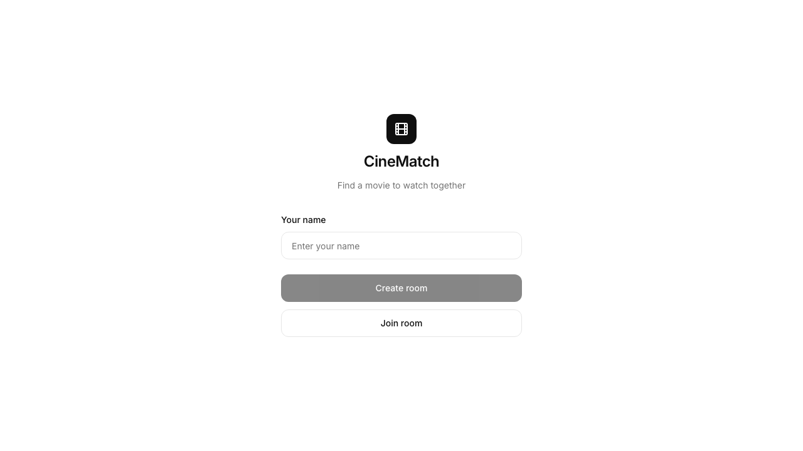
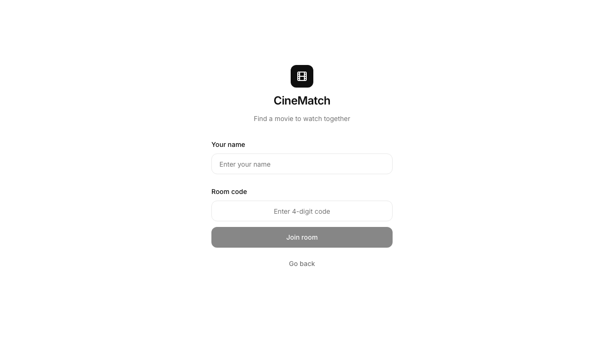
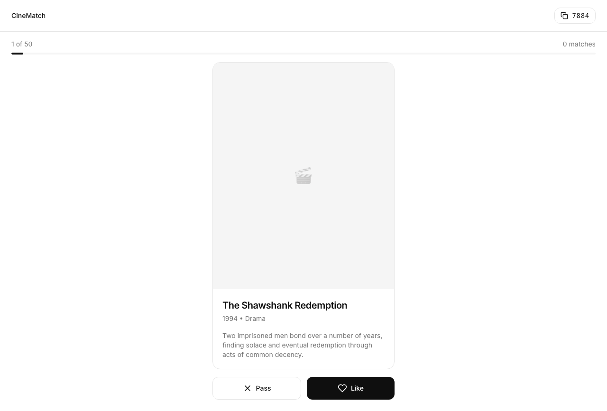

# Minimalistic UI Redesign

Redesign the CineMatch frontend with a clean, professional, minimal aesthetic inspired by Linear, Notion, and Apple design systems.

## Current State

The UI currently has:
- Pink/rose gradient backgrounds
- Generic shadcn/ui components
- No clear visual hierarchy
- Dated swipe card design
- Inconsistent spacing

## Goal

Transform the UI to feel like a premium, modern application with:
- Clean, minimal aesthetic
- Consistent spacing and typography
- Subtle, purposeful interactions
- Professional color palette

## Design System

### Color Palette

```
--background: #ffffff
--foreground: #0f0f0f
--muted: #f5f5f5
--muted-foreground: #737373
--border: #e5e5e5
--primary: #0f0f0f
--primary-foreground: #ffffff
--accent: #0066ff
--radius: 0.75rem
```

### Typography

- Font: Inter (existing)
- Hero: 32px/700
- Title: 24px/600
- Body: 16px/400
- Small: 14px/400
- Tiny: 12px/500

### Spacing Scale

```
4px, 8px, 16px, 24px, 32px, 48px, 64px
```

## Implementation Plan

### Phase 1: Foundation
- [x] Update CSS variables in globals.css
- [x] Update tailwind config if needed
- [x] Create color reference in components

### Phase 2: Landing Page
- [x] Redesign centered layout
- [x] Single name input
- [x] Clean create/join flow
- [x] Remove gradients, use solid colors

### Phase 3: Room/Swipe Page
- [x] Redesign movie card
- [x] Add progress indicator
- [x] Clean header with room code
- [x] Simplified like/pass buttons
- [x] Match celebration modal

### Phase 4: Polish
- [x] Consistent spacing audit
- [x] Hover states
- [x] Focus states
- [x] Loading states

## Screenshots

### 1. Landing Page - Create Room
Clean centered layout with logo, single input for name, and two clear CTAs:
- Primary: "Create room" (filled black button)
- Secondary: "Join room" (outlined button)



### 2. Landing Page - Join Room
When user clicks "Join room", form expands to show room code input with tracking-wider monospace font:



### 3. Room Page - Movie Swiping
Main swiping interface showing:
- Header with CineMatch logo and copy-to-clipboard room code
- Progress bar (1 of 50 movies)
- Match counter
- Movie card with placeholder poster, title, year, genre, description
- Pass (outlined) and Like (filled) buttons



## Testing Checklist

- [x] Landing page renders correctly
- [x] Can create room
- [x] Can join room with code
- [x] Movie cards display properly
- [x] Like/pass buttons work
- [ ] Match modal appears
- [ ] Responsive on mobile
- [ ] Dark mode (optional)

## Success Criteria

- UI feels premium and intentional
- No visual clutter or unnecessary elements
- Clear visual hierarchy
- Consistent spacing throughout
- Fast, snappy interactions
